# Instalar WordPresss y Configurar Pluggins

## WordPress y dependencias
- Instalación con docker-compose 

## Usuarios y Contraseñas que se deben cambiar en el archivo docker-compose.yml
- MYSQL_ROOT_PASSWORD: password
- MYSQL_PASSWORD: wordpress

### Correr localmente usando docker

1. Clonar el repositorio al directorio local de instalación
git clone https://github.com/rcaceres1966/wpress.git

2. Para correr los contenedores

cd wpress
docker compose up

3. Para detener los contenedores

docker compose down

# Paso 1) Correr WordPress y Configurar

- http://localhost:8000/
- Configure Site Title e.g. WCMX
- Username e.g. admin
- Password e.g. 123456 
- Confirm Password checked
- Press Install Button

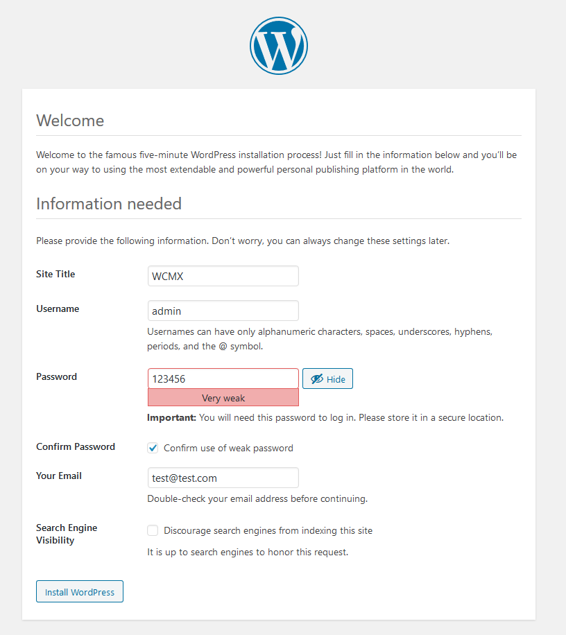

# Paso 2)Login WordPresss 

- Press Log In button

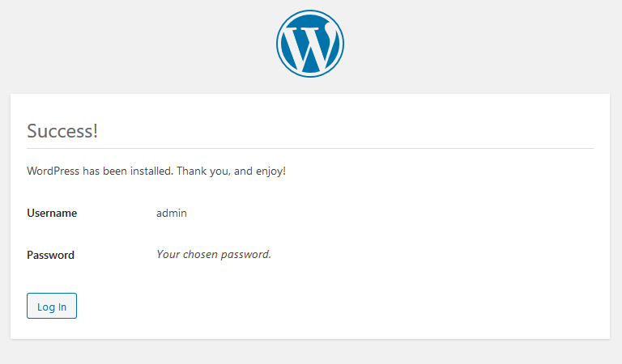

# Paso 3) Login WordPresss con Username y Password

- Login with Username admin
- Password 123456 

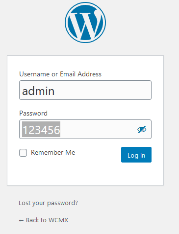

# Paso 4) Seleccionar Menu Pluggins

- Select Option Pluggins

# Paso 5) Agregar Pluggins

- Add Pluggin Guttentor 
- Select Guttentor pluggin and press Install Now

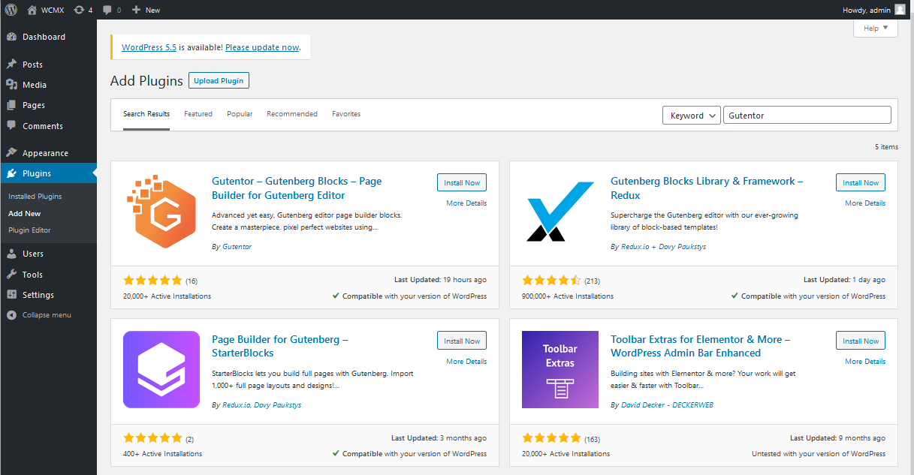

# Paso 6) Agregar Pluggins

- Add Pluggin Classic Editor
- Select Button Activate

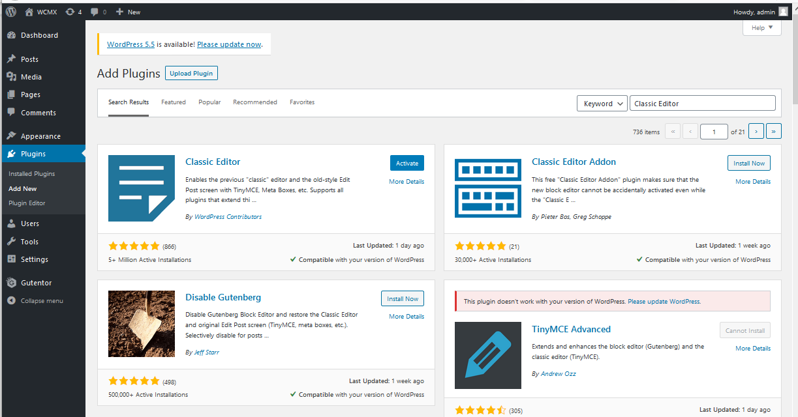

# Paso 6) Agregar Pluggins

- Add Pluggin Addons for Gutenberg
- Select Instal Now
- Select Button Activate

# Paso 7) Configurar Block editor

- Select Settings
- Choose Block editor
- Button Save Changes

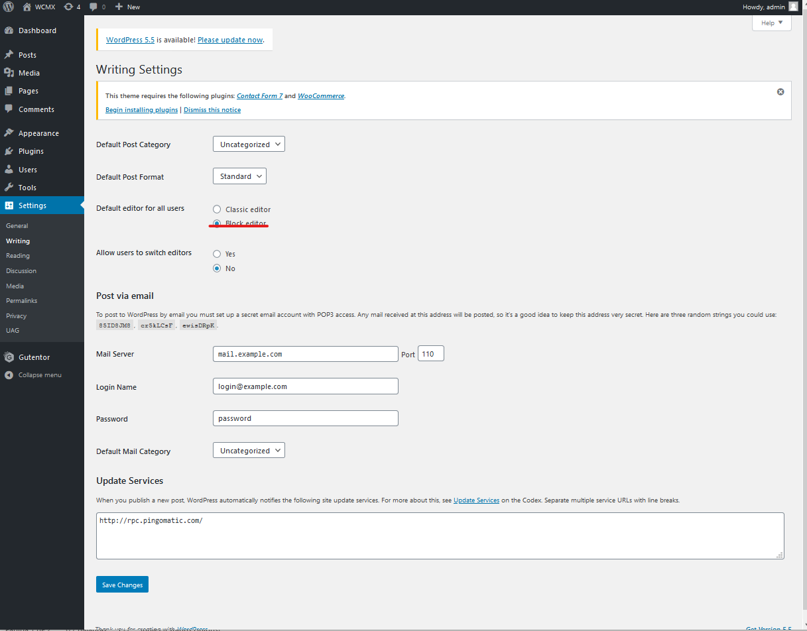

# Paso 8) Agregar un Tema

- Select Appereance Menu
- Choose Add New Theme
- Search Ample Bussiness Epic
- Add Theme

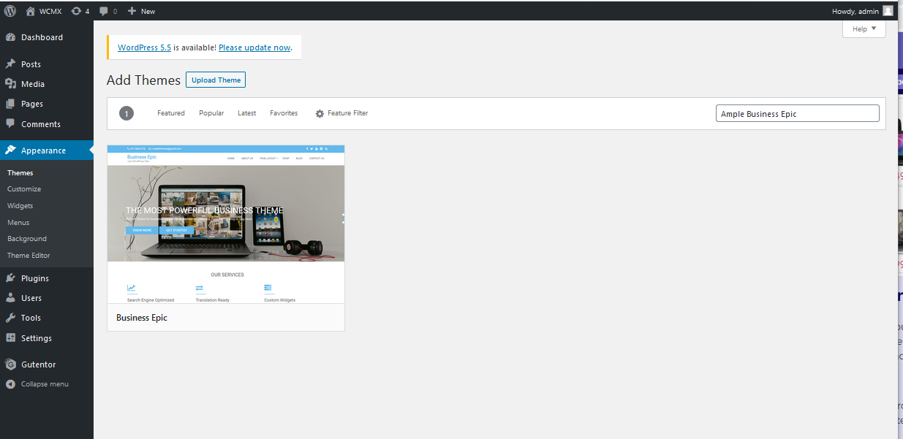

# Paso 8) Importar una Pagina

- Menu Tools
- Select Upload file and import
- Choose wcmx.WordPress.2020-08-10.xml file

# Paso 9) Editar un Post

- Esto importa el ejemplo pero no la media (imagenes)

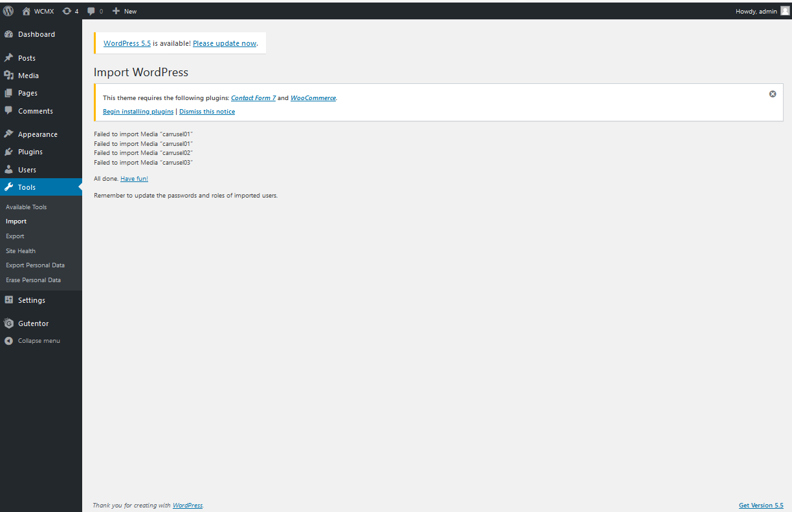

# Paso 10) Editar Post

- Select Posts Menu
- Select Test 2 Post

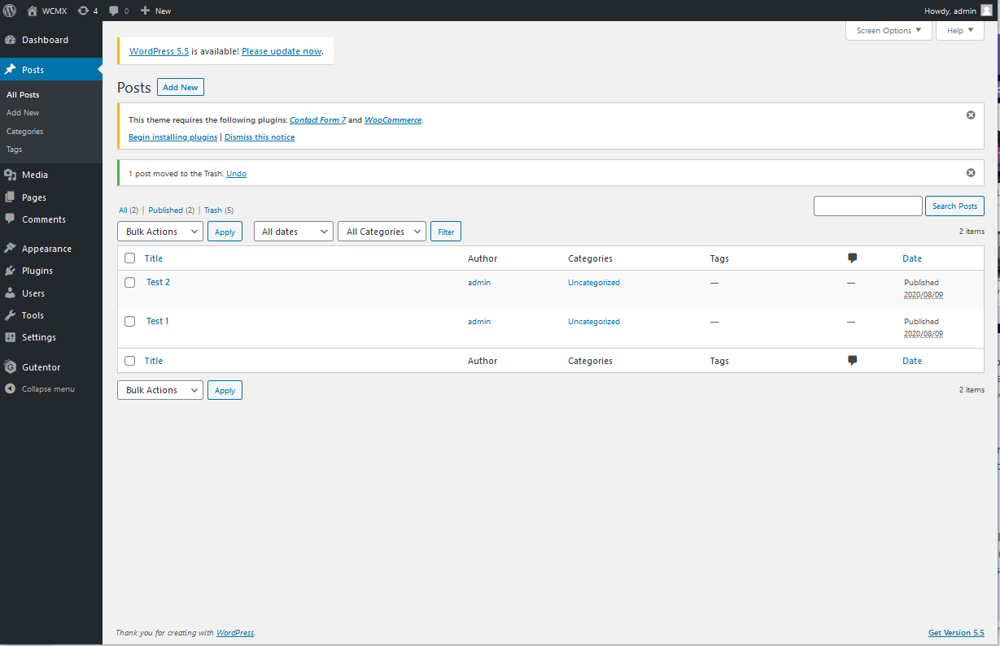

# Paso 11) Agregar Media a Post 2

- Select Post and Button Edit Image
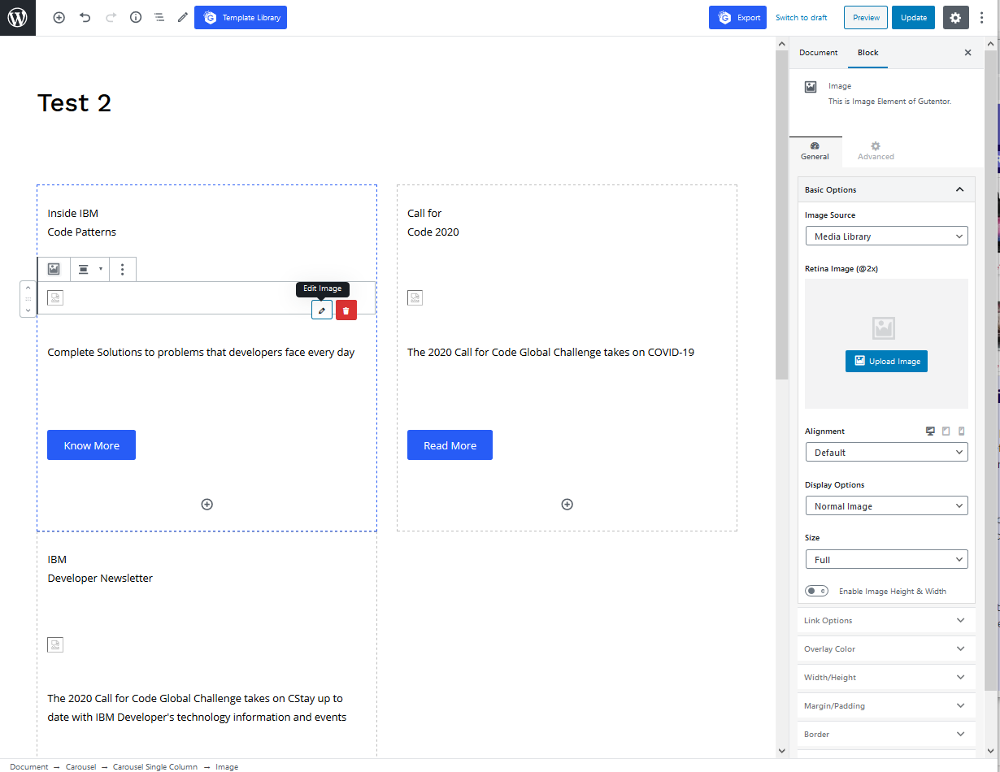

- Upload images carrusel01-1.jpg carrusel02.jpg carrusel03.jpg
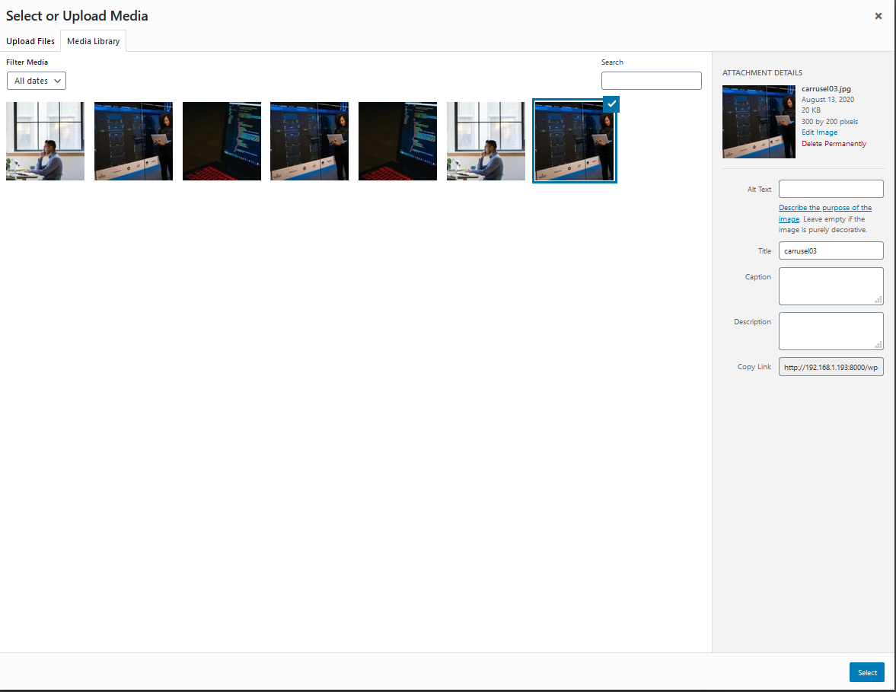

- Select image for other post
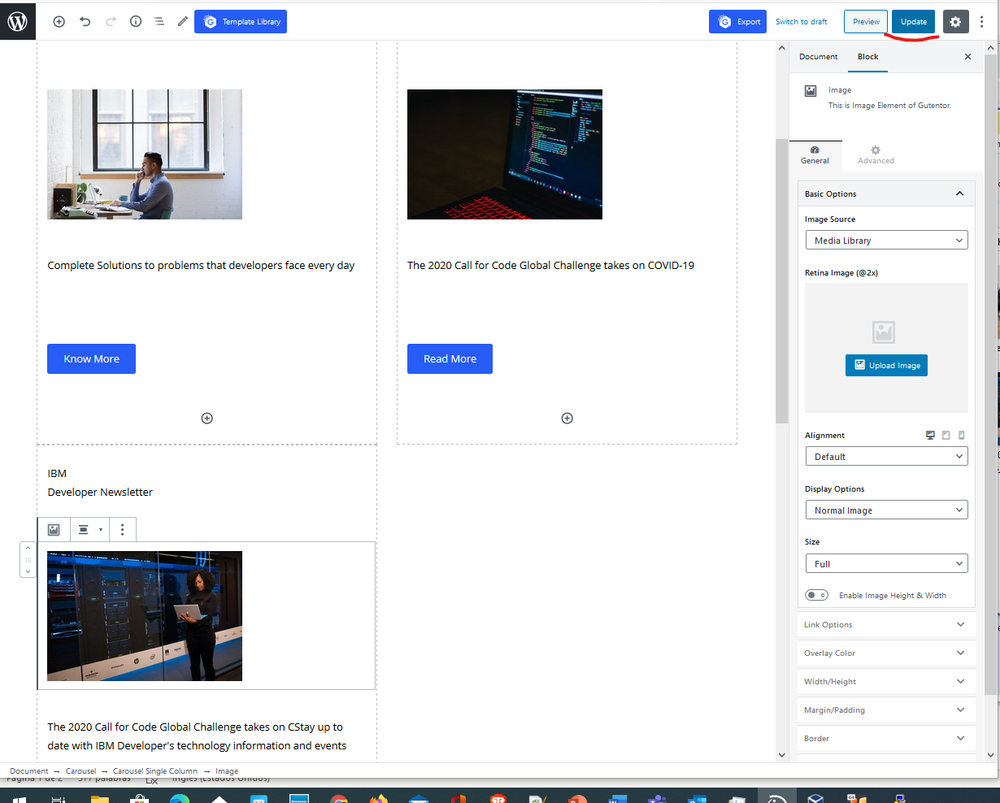

