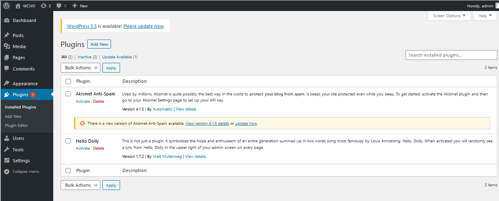
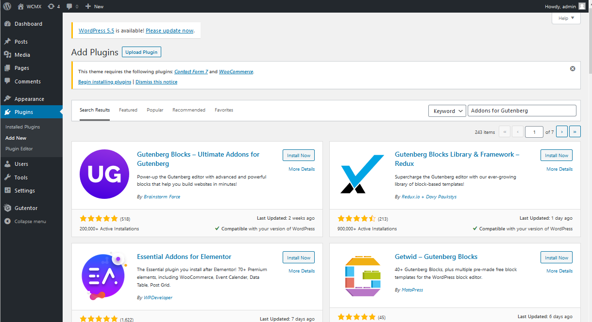
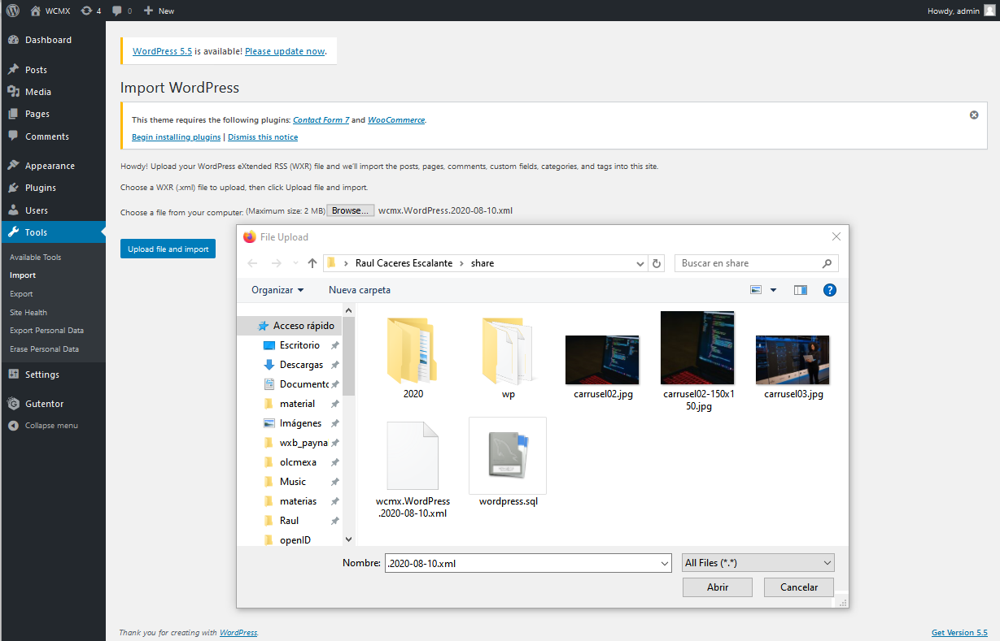

# Install WordPresss and Configure Pluggins

## WordPress and dependencies
- This docker-compose install 

## Users and Passwords to change in docker-compose.yml file
- MYSQL_ROOT_PASSWORD: password
- MYSQL_PASSWORD: wordpress

### Run locally using docker

1. copy docker-compose.yml to your Install directory

2. Run the containers

docker compose up

3. Stop the instances

docker compose down

# Step 1) Run WordPresss and Configure

- http://localhost:8000/
- Configure Site Title e.g. WCMX
- Username e.g. admin
- Password e.g. 123456 
- Confirm Password checked
- Press Install Button

# Step 2)Login WordPresss 

- Press Log In button

# Step 3) Login WordPresss with Username and Password

- Login with Username admin
- Password 123456 

# Step 4) Select Pluggins Menu

- Select Option Pluggins

# Step 5) Add Pluggins

- Add Pluggin Guttentor 
- Select Guttentor pluggin and press Install Now

# Step 6) Add Pluggins

- Add Pluggin Classic Editor
- Select Button Activate

# Step 6) Add Pluggins

- Add Pluggin Addons for Gutenberg
- Select Instal Now
- Select Button Activate

# Step 7) Configure Block editor

- Select Settings
- Choose Block editor
- Button Save Changes

# Step 8) Add a Theme

- Select Appereance Menu
- Choose Add New Theme
- Search Ample Bussiness Epic
- Add Theme

# Step 8) Import a Page

- Menu Tools
- Select Upload file and import
- Choose wcmx.WordPress.2020-08-10.xml file

# Step 9) Edit Post

- This import the example page but not the media (images)

# Step 10) Edit Post

- Select Posts Menu
- Select Test 2 Post

# Step 11) Add Media to Post 2

- Select Post and Button Edit Image

- Upload images carrusel01-1.jpg carrusel02.jpg carrusel03.jpg

- Select image for other post

